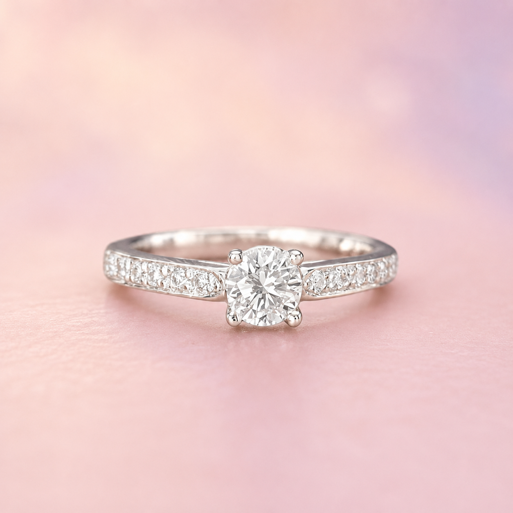

# Diamond Reflection Animation

Standalone luxury jewelry image animation using `index.html`, `styles.css`, and `script.js`.

## Run Locally

Open `index.html` in a browser for desktop mouse testing, or serve the folder locally:

```bash
python3 -m http.server 8080
```

Then visit `http://localhost:8080`.

## Mobile Testing

For iPhone Safari, DeviceOrientation permission must be requested from a user tap. Use the `Enable phone motion` button. Motion APIs work best on HTTPS or localhost. If testing from another phone on your network, use a local HTTPS tunnel or deploy the files to a secure preview URL.

## Adjusting the Diamond Area

In `script.js`, edit:

```js
const diamondX = 50;
const diamondY = 48;
const diamondWidth = 34;
const diamondHeight = 34;
```

These values position and size the animated overlay hotspot. The base image remains unchanged; only highlights, fire, and sparkle canvas effects are layered above it.

## Replacing the Image

Change the image path in `index.html`:

```html

```

Keep the overlay markup in place and adjust the hotspot variables until the effect sits over the diamond.
